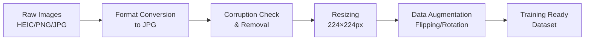
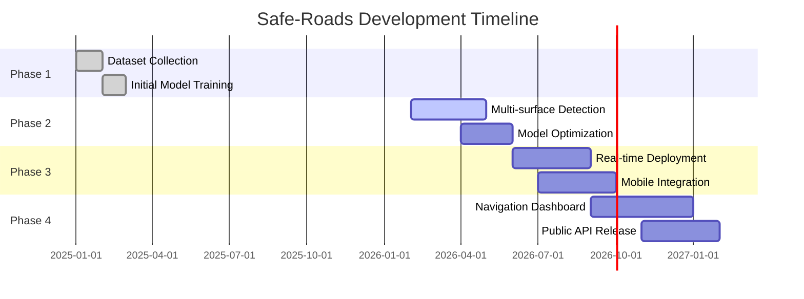

<div align="center">


# 🛣️ Safe-Roads
### ML-Based Road Infrastructure Monitoring Lab

[](https://github.com/Safe-Roads)
[](https://www.python.org/)
[](https://www.tensorflow.org/)
[](https://opencv.org/)
[](LICENSE)

</div>

---

## 📌 About Us

**Safe-Roads** is a cutting-edge research initiative dedicated to revolutionizing road infrastructure monitoring through artificial intelligence and computer vision. Our organization focuses on developing intelligent systems that can automatically detect and classify road surface damage, particularly potholes, to enhance transportation safety and infrastructure maintenance efficiency.

### 🎯 Our Mission

To design, develop, and deploy a **high-accuracy pothole detection system** capable of identifying road surface damage using state-of-the-art deep learning techniques, ultimately contributing to safer roads and more efficient infrastructure management.

### 🌟 Vision

To extend **Safe-Roads** into a comprehensive, scalable ML-based solution that supports nationwide road monitoring systems, enabling proactive infrastructure maintenance and saving millions in reactive repair costs.

---

## 🚀 What We Do

<div align="center">

| 🔍 Research | 🤖 Development | 📊 Analysis | 🚦 Deployment |
|:---:|:---:|:---:|:---:|
| Cutting-edge ML research | CNN-based detection models | Dataset preparation & analysis | Real-time road monitoring |

</div>

### Key Focus Areas:
- **Computer Vision** - Advanced image processing and object detection
- **Deep Learning** - CNN architectures for accurate classification
- **Data Science** - Large-scale dataset management and preprocessing
- **Road Safety** - Contributing to safer transportation infrastructure
- **Infrastructure Monitoring** - Automated inspection systems

---

## 📊 Current Project Status

### 📈 Dataset Overview

<div align="center">


</div>

**📍 Total Images: 6,738**

| 📂 Category | 🖼️ Number of Images | 📊 Percentage |
|-------------|---------------------|---------------|
| 🛣️ Asphalt Road (Normal) | 2,000 | 29.7% |
| 🕳️ Pothole (Damaged) | 4,738 | 70.3% |

### 📂 Data Collection & Formats

Our dataset comprises high-quality road surface images captured from various sources:

**Original Image Formats:**
- **HEIC** – High Efficiency Image Container (Apple devices)
- **PNG** – Portable Network Graphics (Lossless compression)
- **JPG/JPEG** – Joint Photographic Experts Group (Standard format)

All images are standardized to **JPG format** for optimal machine learning compatibility and processing efficiency.

### 🔄 Data Preprocessing Pipeline

<div align="center">



</div>

**Preprocessing Steps Implemented:**

✅ **Format Standardization** – Converting HEIC/PNG formats to JPG  
✅ **Quality Control** – Identifying and removing corrupted images  
✅ **Image Resizing** – Standardizing to 224 × 224 pixels  
✅ **Data Augmentation** – Horizontal flipping, rotation, brightness adjustment  
✅ **Normalization** – Pixel value scaling for model optimization  
✅ **Train/Val/Test Split** – Proper dataset partitioning (70/20/10)

---

## 🤖 Model Performance & Architecture

<div align="center">


</div>

### 🎯 Current Model Specifications

| Parameter | Value |
|-----------|-------|
| **Input Size** | 224 × 224 × 3 (RGB) |
| **Classes** | 2 (Road, Pothole) |
| **Architecture** | Convolutional Neural Network (CNN) |
| **Road Type** | Asphalt surfaces |
| **Validation Accuracy** | **98.0%** |
| **Precision** | 97.5% |
| **Recall** | 98.3% |
| **F1-Score** | 97.9% |

### 📊 Performance Metrics

<div align="center">


</div>

### ⚠️ Current Limitations

> **Note:** The current model version is trained exclusively on **asphalt road surfaces**. Performance on concrete, gravel, or other road types may vary.

**Planned Improvements:**
- Multi-surface road type detection
- Weather condition adaptability
- Real-time video processing
- Severity classification

---

## 📁 Organization Repositories

<div align="center">

| 📦 Repository | 🎯 Purpose | 🔒 Visibility | 🔧 Tech Stack |
|---------------|-----------|---------------|---------------|
| [`pothole-detection-model`](https://github.com/Safe-Roads/pothole-detection-model) | Core ML model development & training | Public | Python, TensorFlow, OpenCV |
| [`Documentation`](https://github.com/Safe-Roads/Documentation) | Research papers, reports & documentation | Public | Markdown, LaTeX |
| [`dataset`](https://github.com/Safe-Roads/dataset) | Curated image datasets | Private | Image files, metadata |
| [`Safe-Roads.github.io`](https://github.com/Safe-Roads/Safe-Roads.github.io) | Organization website & portfolio | Private | HTML, CSS, JavaScript |
| [`.github`](https://github.com/Safe-Roads/.github) | Organization profile & community health | Public | Markdown |

</div>

---

## 🛠️ Technologies & Tools

<div align="center">

### Core Technologies


### Development Tools


</div>

### 📚 Technical Stack Details

**Machine Learning & AI:**
- TensorFlow 2.x / Keras - Deep learning framework
- Convolutional Neural Networks (CNN) - Core architecture
- Transfer Learning - Pre-trained model fine-tuning
- Model Optimization - Quantization & pruning

**Computer Vision:**
- OpenCV - Image processing and manipulation
- PIL/Pillow - Image file handling
- scikit-image - Advanced image operations

**Data Processing:**
- NumPy - Numerical computations
- Pandas - Data manipulation and analysis
- Matplotlib/Seaborn - Data visualization

**Development & Collaboration:**
- Git/GitHub - Version control and collaboration
- Jupyter Notebooks - Interactive development
- Python virtual environments - Dependency management

---

## 🗺️ Project Roadmap

<div align="center">



</div>

### 📅 Detailed Development Phases

#### ✅ **Phase 1** – Dataset Preparation & Initial Model (COMPLETED)
- [x] Data collection from multiple sources
- [x] Image preprocessing and standardization
- [x] Initial CNN model development
- [x] Baseline accuracy achievement (98%)
- [x] Repository structure setup

#### 🔄 **Phase 2** – Multi-Surface Road Detection (IN PROGRESS)
- [ ] Concrete road surface training
- [ ] Gravel/unpaved road detection
- [ ] Brick paved road classification
- [ ] Enhanced data augmentation

#### 🔮 **Phase 3** – Real-Time Deployment (PLANNED)
- [ ] Video stream processing
- [ ] Real-time inference optimization
- [ ] Navigation application development
- [ ] GPS integration for location tracking

#### 🚀 **Phase 4** – Navigation Dashboard & Integration (FUTURE)
- [ ] Web-based monitoring dashboard
- [ ] RESTful API development
- [ ] Geographic visualization (maps integration)
- [ ] Automated reporting system

---

## 📌 Academic Transparency & Research Standards

We maintain the highest standards of academic integrity and project management:

### 🔍 Project Management

<div align="center">

| 📋 Practice | 🎯 Purpose |
|-------------|-----------|
| **Structured Issue Tracking** | Transparent task management and bug reporting |
| **Milestone-Based Progress** | Clear development goals and checkpoints |
| **Pull Request Reviews** | Code quality assurance and peer review |
| **Contribution Logs** | Complete development history and attribution |
| **Weekly Progress Reports** | Regular updates and accountability |
| **Documentation Standards** | Comprehensive technical documentation |

</div>

### 📊 Research Outputs

- **Research Papers** - Methodology and findings documentation
- **Technical Reports** - Detailed implementation guides
- **Dataset Documentation** - Comprehensive data source attribution
- **Model Cards** - ML model specifications and limitations
- **Reproducibility** - Open-source code and detailed procedures

---

## 👥 Team & Contributors

<div align="center">

### 🌟 Core Team

<!-- Add actual contributor avatars here -->
<a href="https://github.com/Safe-Roads/pothole-detection-model/graphs/contributors">
  
</a>


</div>

### 🤝 How to Contribute

We welcome contributions from researchers, developers, and road safety enthusiasts! See our [Contributing Guidelines](https://github.com/Safe-Roads/.github/blob/main/CONTRIBUTING.md) to get started.

---

## 📫 Connect With Us

<div align="center">

[](https://github.com/Safe-Roads)
[](https://safe-roads.github.io)
[](mailto:contact@om.khalane24@pccoepune.org)

</div>

---

## 📜 License & Citation

This project is maintained for research and educational purposes.

**If you use our work, please cite:**
```bibtex
@misc{safe-roads-2026,
  title={Safe-Roads: ML-Based Pothole Detection System},
  author={Safe-Roads Organization},
  year={2026},
  publisher={GitHub},
  url={https://github.com/Safe-Roads}
}
```

---

## 📊 Organization Statistics

<div align="center">


---

<div align="center">

### 🛣️ Building Safer Roads Through Technology

**Made with ❤️ by the Safe-Roads Team**

*Last Updated: February 2026*

</div>
